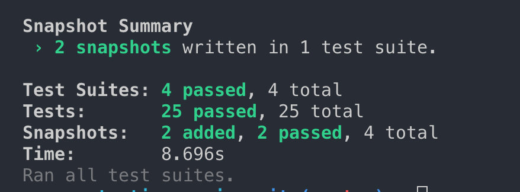
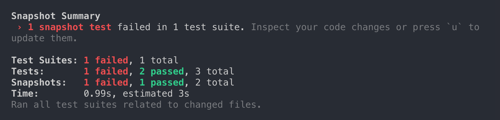

# Snapshot Testing {#chapter-9}

So far, you've seen how you can test Vue.js component's structure, styles, methods, computed properties, events, watchers, and more. And you've learnt to do that using different techniques and methods.

But what if I tell you that you can test most of it just using snapshot testing?

You've already seen snapshots being used in chapters 1 and 2, but those chapters were more focused on explaining shallow and deep rendering, so I haven't explained it in detail yet.

**Snapshot testing** is the technique of asserting by comparing two different outputs.

Think of it as something similar to what the screenshot technique used in end to end tests to check regressions: the first test run takes a screenshot of a part of the screen (for instance: a button), and from that moment on all the following runs of the same test will compare a new screenshot with the original one. If they're the same, the test passes, otherwise there is a regression.

Snapshot testing works in the same way, but instead of comparing images, it compares serializable output such as json, html or just strings.

Since Vue.js renders html, you can use snapshot testing to assert the rendered html given different states of a component.

## Rethinking in Snapshots

For this example, let's consider the following `ContactBox.vue` component:

```html
<template>
  <div :class="{ selected: selected }" @click="handleClick">
    <p>{{ fullName }}</p>
  </div>
</template>

<script>
  export default {
    props: ["id", "name", "surname", "selected"],
    computed: {
      fullName() {
        return `${this.name} ${this.surname}`;
      }
    },
    methods: {
      handleClick() {
        this.$emit("contact-click", this.id);
      }
    }
  };
</script>
```

In this case, we can test several things of this component:

- `fullName` is the combination of `name` + `surname`
- It has a `selected` class when the component is selected
- Emits a `contact-click` event

One way to create tests that validate these specifications would be to check everything separately: the classes attached to the DOM elements, the HTML structure, the computed properties and state...

As you've seen in other chapters, you could do these tests as follows:

```js
import { mount } from "vue-test-utils";
import ContactBox from "../src/components/ContactBox";

const createContactBox = (id, name, surname, selected) =>
  mount(ContactBox, {
    propsData: { id, name, surname, selected }
  });

describe("ContactBox.test.js", () => {
  it("fullName should be the combination of name + surname", () => {
    const cmp = createContactBox(0, "John", "Doe", false);
    expect(cmp.vm.fullName).toBe("John Doe");
  });

  it("should have a selected class when the selected prop is true", () => {
    const cmp = createContactBox(0, "John", "Doe", true);
    expect(cmp.classes()).toContain("selected");
  });

  it("should emit a contact-click event with its id when the component is clicked", () => {
    const cmp = createContactBox(0, "John", "Doe", false);
    cmp.trigger("click");

    const payload = cmp.emitted("contact-click")[0][0];
    expect(payload).toBe(0);
  });
});
```

But now let's think about how can snapshot testing help us here.

If you think about it, the component renders accordingly to its state. Let's call that the **rendering state**.

With snapshot testing, instead of worrying to check for specific things like attributes, classes, methods, computed props and so, we can instead check the rendering state as it is the projected result of the component state.

For that, you can use snapshot testing for the first test from above as follows:

```js
it("fullName should be the combination of name + surname", () => {
  const cmp = createContactBox(0, "John", "Doe", false);
  expect(cmp.element).toMatchSnapshot();
});
```

As you can see, now instead of checking things separately, I'm just asserting the snapshot of `cmp.element`, being the rendered HTML of the component.

If you run the test suite now, a `ContactBox.test.js.snap` file should've been created and you'll see a message in the console output as well:



Let's analyze the snapshot generated:

```js
// Jest Snapshot v1, https://goo.gl/fbAQLP

exports[
  `ContactBox.test.js fullName should be the combination of name + surname 1`
] = `
<div
  class=""
>
  <p>
    John Doe
  </p>
</div>
`;
```

The purpose of this test is to check that the computed property `fullName` combines both name and surname, separated by a space. Taking a look at the snapshot, you can see that's happening and _John Doe_ it's there, so you can consider this test valid.

In the same way, you can write the second test using snapshot testing:

```js
it("should have a selected class when the selected prop is true", () => {
  const cmp = createContactBox(0, "John", "Doe", true);
  expect(cmp.element).toMatchSnapshot();
});
```

Notice that the only thing that changes between this test and the previous one, is this one is setting the `selected` property to true.

That's the power of snapshot testing: you play with **different states of the components** while you just need to assert the rendering state.

The purpose of this test is to validate that it has a `selected` class when the property is true. Let's run again the test suite, and if you check again `ContactBox.test.js.snap`, you'll see another snapshot has been added:

```js
exports[
  `ContactBox.test.js should have a selected class when the selected prop is true 1`
] = `
<div
  class="selected"
>
  <p>
    John Doe
  </p>
</div>
`;
```

And the selected class is there, as we expected, so we can consider this one also valid.

## When Snapshot Testing doesn't help

Have you noticed that I didn't mention anything about the third test? To remember it, let's check it again:

```js
it("should emit a contact-click with its id when the component is clicked", () => {
  const cmp = createContactBox(0, "John", "Doe", false);
  cmp.trigger("click");

  const payload = cmp.emitted("contact-click")[0][0];
  expect(payload).toBe(0);
});
```

In this case, when the component is clicked, it doesn't perform any action that changes the component state, which means that the rendering state won't change. We're just testing behaviour here that has no effect on the rendering of the component.

For that reason, we can say that **snapshot testing is useful to check changes on the rendering state**. If the rendering state doesn't change, there is no way that snapshot testing can help us.

## When a test fails

The snapshots generated are the source of truth for deciding if a test is valid or not. That's the way regressions are checked, and at the end depends on your criteria.

For example, go to the `ContactBox.vue` component and change the `fullName` computed prop to be separated by a comma:

```js
fullName() {
  return `${this.name}, ${this.surname}`;
}
```

If you run the tests again, some of them will fail since the rendering result is different than before. You'll get an error like this:

```
Received value does not match stored snapshot 1.

  - Snapshot
  + Received

    <div
      class=""
    >
      <p>
  -    John Doe
  +    John, Doe
      </p>
    </div>
```

From that point on, as it's usual on testing, you must decide if that's an intentional change or it's a regression. You can press _'u'_ in order to update the snapshots:



It would be convenient when applying TDD to use the watch mode `npm run test -- --watch`, it would be very comfortable since Jest gives you some options to update snapshots:

- Press **'u'** to update all snapshots.
- Press **'i'** to update snapshots interactively, one by one.

## Conclusion

Snapshot testing **saves you a lot of time**. This example was basic, but imagine testing a more complex component with many different rendering states...

Sure you can assert on the specific things, but that's much more cumbersome than asserting how the component is rendered depending on the state, since most of the times if you change the code you must change the assertions on the tests, while with snapshot testing you don't need to.

Additionally, you can **find regressions** that you didn't take into account. Maybe something you didn't consider in your tests something that has changed the rendering of the component, but the snapshots will alert you about that.

But I want to mention some **caveats** that you should remember:

- Snapshot testing doesn't replace specific assertions. While it can do it most of the times, both ways of testing are totally combinable.
- Don't update snapshots too easily. If you see that a test fails because it doesn't match a snapshot, take a deep look at it before updating it too quickly. I've been there as well.

If you want to try yourself, you can find the [full example of this chapter on Github](https://github.com/alexjoverm/vue-testing-series/tree/chapter-9).