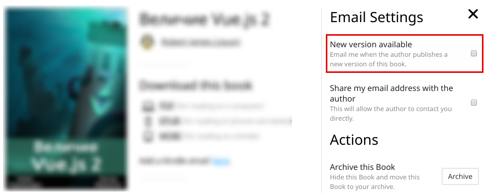

# Предисловие

Спасибо, что купили перевод книги [Testing Vue.js components with Jest](https://leanpub.com/testingvuejscomponentswithjest)! Если вы купили эту книгу, значит у вас достаточный уровень знаний Vue.js, если это не так, либо вы хотите улучшить свои знания или просто поддержать русское сообщество Vue.js (поскольку я участвую в переводе официальной документации и стараюсь делать это хорошо), то можете рассмотреть покупку переводной книги [Величие Vue.js 2](https://leanpub.com/vuejs2-russian)!

## Обновления

При покупке книги я настоятельно рекомендовал вам подписаться на обновления по электронной почте. Если вы этого не сделали, то есть возможность сделать это сейчас. Зайдите на [страницу со всеми вашими книгами на Leanpub](https://leanpub.com/user_dashboard/library), выберите эту книгу и справа в блоке «Email Settings» отметьте галочкой «New version available», как показано на скриншоте:

Теперь вы будете знать об обновлениях книги, потому что я планирую обновлять материал, если он будет с течением времени устаревать. Но даже не это главное: я планирую расширять книгу, добавив главы про тестирование Vuex и Vue Router, возможно даже что-то ещё. Так что, держите руку на пульсе! Я не обещаю, что это проийзодёт очень быстро, или что даже, это будет в рамках этой книги, но в любом случае вы эту информацию **бесплатно**.

## Принятые соглашения

В тексте данного перевода книги используется буква «ё» и терминология из замечательного [словаря «Веб-стандартов»](https://github.com/web-standards-ru/dictionary), поэтому, в случае непонятного слова, обращайтесь к этому словарю за разъяснением.

## Обратная связь

Хоть это и небольшая книга, но ошибки не исключены, несмотря на то, что я попытался сделать всё возможное, чтобы их не было. Однако, если вы нашли опечатку или неточность, пожалуйста, сообщите об этом, создав ишью в [репозитории книги](https://github.com/alexjoverm/testing-vue-book-ru).